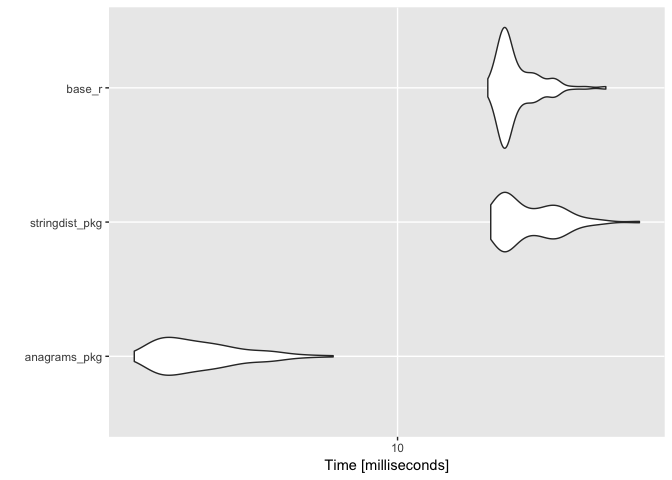
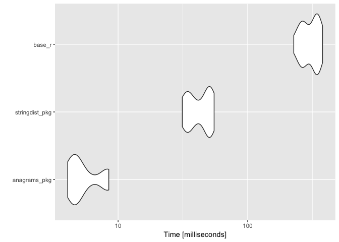

<!-- README.md is generated from README.Rmd. Please edit that file -->
anagrams
========

[](https://travis-ci.org/ChrisMuir/anagrams)

`anagrams` is a super simple R package providing a function for comparing character vectors and determining if strings are [anagrams](https://en.wikipedia.org/wiki/Anagram) of one another. The project was inspired by [this](http://www.programmingr.com/content/simple-anagram-finder-using-r/) blog post on finding anagrams in R. The package uses C++ and [Rcpp](https://CRAN.R-project.org/package=Rcpp) for speed.

If you're interested in anagrams and R, be sure to check out [Romain Francois'](https://github.com/romainfrancois) package [anagram](https://github.com/romainfrancois/anagram) (and h/t to Romain for [pointing out](https://twitter.com/romain_francois/status/972754279164514304) some bottle-necks in my cpp code).

Also, thank you to [Mark van der Loo](https://github.com/markvanderloo) for pointing out that the [stringdist](https://github.com/markvanderloo/stringdist) package can be used to concisely determine same-length anagrams (and it's faster than the base R function I defined below!) I included the `stringdist` solution in the benchmarks below.

Installation
------------

Install from github with:

``` r
# install.packages("devtools")
devtools::install_github("ChrisMuir/anagrams")
```

Example Usage
-------------

The exported function `is_anagram` takes as input a string and a character vector, and looks for anagrams of the string in the character vector.

``` r
library(anagrams)

# Test for anagrams that are the same length as the input string.
is_anagram("stac", c("cats are great", "tacs", "frogs", "cats", "ts"))
#> [1] FALSE  TRUE FALSE  TRUE FALSE

# Use arg "value" to return the values that are anagrams.
is_anagram("stac", c("cats are great", "tacs", "frogs", "cats", "ts"), value = TRUE)
#> [1] "tacs" "cats"

# Set arg "any_len" to TRUE to test for anagrams that are any length (either same length or sub-string).
is_anagram("stac", c("cats are great", "tacs", "frogs", "cats", "ts"), any_len = TRUE)
#> [1]  TRUE  TRUE FALSE  TRUE FALSE

# Use arg "ignore_spaces" to make anagram searching insensitive to spaces.
is_anagram("s t a c", c("cats are great", "t acs", "frogs", "ca   ts", "ts"), ignore_spaces = TRUE)
#> [1] FALSE  TRUE FALSE  TRUE FALSE

# Use arg "ignore_case" to make anagram searching insensitive to lower/upper case.
is_anagram("STAc", c("catS are great", "tacs", "frogs", "CaTS", "ts"), ignore_case = TRUE)
#> [1] FALSE  TRUE FALSE  TRUE FALSE
```

Benchmarks
----------

Let's create a simple, base R version of `is_anagram` that searches for same-length anagrams, and compare speeds.

``` r
r_is_anagram <- function(string, terms) {
  out <- rep(FALSE, length(terms))
  terms_to_insp <- which(nchar(terms) == nchar(string))
  if (length(terms_to_insp) == 0) {
    return(out)
  }
  
  string_spl <- unlist(strsplit(string, "", fixed = TRUE), FALSE, FALSE)
  str_counts <- vapply(string_spl, function(x) sum(string_spl == x), integer(1))
  terms_spl <- strsplit(terms, "", fixed = TRUE)
  
  out[terms_to_insp] <- vapply(terms_spl[terms_to_insp], function(x) {
    anagram <- TRUE
    for (char in string_spl) {
      if (str_counts[char] != sum(x == char)) {
        anagram <- FALSE
        break
      }
    }
    anagram
  }, logical(1), USE.NAMES = FALSE)
  
  out
}

# Test to make sure its output is identical to that of pkg function is_anagram.
identical(
  r_is_anagram("stac", c("cats are great", "tacs", "frogs", "cats", "ts")), 
  is_anagram("stac", c("cats are great", "tacs", "frogs", "cats", "ts"))
)
#> [1] TRUE
```

And for completeness, here is a similar function that uses `stringdist::stringdist()` to find same-length anagrams.

``` r
library(stringdist)

sd_is_anagram <- function(string, terms) {
  out <- rep(FALSE, length(terms))
  terms_to_insp <- which(nchar(terms) == nchar(string))
  if (length(terms_to_insp) == 0) {
    return(out)
  }
  
  out[terms_to_insp] <- stringdist(string, terms[terms_to_insp], method="qgram", q=1) == 0
  
  out
}

# Test to make sure its output is identical to that of pkg function is_anagram.
identical(
  sd_is_anagram("stac", c("cats are great", "tacs", "frogs", "cats", "ts")), 
  is_anagram("stac", c("cats are great", "tacs", "frogs", "cats", "ts"))
)
#> [1] TRUE
```

Now we'll compare speeds.

``` r
library(microbenchmark)
library(stringi)


# Test in which each element is shorter than the input string.

test_vect <- stringi::stri_rand_strings(100000, 3)
microbenchmark(
  anagrams_pkg = is_anagram("cats", test_vect), 
  stringdist_pkg = sd_is_anagram("cats", test_vect), 
  base_r = r_is_anagram("cats", test_vect)
) -> mb

print(mb)
#> Unit: milliseconds
#>            expr       min        lq      mean    median       uq       max
#>    anagrams_pkg  2.957764  3.409829  4.078948  3.801082  4.48639  7.423282
#>  stringdist_pkg 15.389827 16.377030 18.577019 17.426925 20.54258 30.622117
#>          base_r 15.183233 16.304469 17.416938 16.612113 18.13074 26.212652
#>  neval
#>    100
#>    100
#>    100

autoplot.microbenchmark(mb)
```



``` r


# Test in which each element is the same length as the input string.

test_vect <- stringi::stri_rand_strings(100000, 4)
microbenchmark(
  anagrams_pkg = is_anagram("cats", test_vect), 
  stringdist_pkg = sd_is_anagram("cats", test_vect), 
  base_r = r_is_anagram("cats", test_vect), 
  times = 25
) -> mb

print(mb)
#> Unit: milliseconds
#>            expr        min         lq       mean     median         uq
#>    anagrams_pkg   4.087133   4.569417   5.599958   4.780649   6.400926
#>  stringdist_pkg  31.278478  34.425687  43.078357  43.818700  50.396274
#>          base_r 226.697082 266.585187 306.877894 320.374032 343.670839
#>         max neval
#>    8.476718    25
#>   55.042446    25
#>  378.102585    25

autoplot.microbenchmark(mb)
```



``` r


# Test in which each element is an anagram of the input string.

test_vect <- rep("tacs", 100000)
microbenchmark(
  anagrams_pkg = is_anagram("cats", test_vect), 
  stringdist_pkg = sd_is_anagram("cats", test_vect), 
  base_r = r_is_anagram("cats", test_vect), 
  times = 25
) -> mb

print(mb)
#> Unit: milliseconds
#>            expr       min         lq      mean    median        uq
#>    anagrams_pkg   6.22285   7.859184  10.09603  11.90370  12.20088
#>  stringdist_pkg  20.26465  24.614183  31.34636  33.67018  39.22784
#>          base_r 529.31476 582.450234 616.83824 610.96686 666.67961
#>        max neval
#>   12.52686    25
#>   41.83024    25
#>  711.63826    25

autoplot.microbenchmark(mb)
```


``` r


# Test in which each element is a string with length between two and six chars.

test_vect <- stringi::stri_rand_strings(100000, 2:6)
microbenchmark(
  anagrams_pkg = is_anagram("cats", test_vect), 
  stringdist_pkg = sd_is_anagram("cats", test_vect), 
  base_r = r_is_anagram("cats", test_vect), 
  times = 25
) -> mb

print(mb)
#> Unit: milliseconds
#>            expr       min         lq       mean     median         uq
#>    anagrams_pkg  3.425526   4.889977   5.393258   5.657923   5.980561
#>  stringdist_pkg 21.244149  26.281611  32.153515  34.469034  36.891975
#>          base_r 84.169148 108.293165 134.501019 141.014277 160.677025
#>        max neval
#>    6.53689    25
#>   39.95555    25
#>  168.68358    25

autoplot.microbenchmark(mb)
```


``` r


# Test in which each element is a long string (nchar == 1000).

test_str <- stringi::stri_rand_strings(1, 1000)
test_vect <- stringi::stri_rand_strings(100000, 1000)
microbenchmark(
  anagrams_pkg = is_anagram(test_str, test_vect), 
  stringdist_pkg = sd_is_anagram(test_str, test_vect), 
  base_r = r_is_anagram(test_str, test_vect), 
  times = 25
) -> mb

print(mb)
#> Unit: milliseconds
#>            expr        min         lq       mean     median         uq
#>    anagrams_pkg   67.89607   69.44413   74.34844   72.27528   80.50824
#>  stringdist_pkg 2137.45272 2193.71352 2232.09559 2222.14421 2254.58533
#>          base_r 5017.80263 5317.17637 5569.97980 5585.67973 5662.55602
#>        max neval
#>    85.3776    25
#>  2439.8614    25
#>  7100.0503    25

autoplot.microbenchmark(mb)
```


