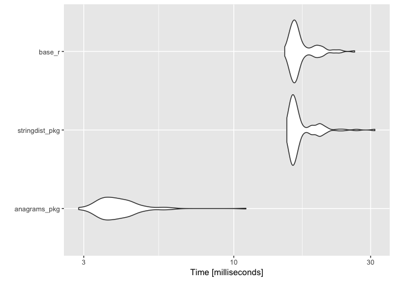
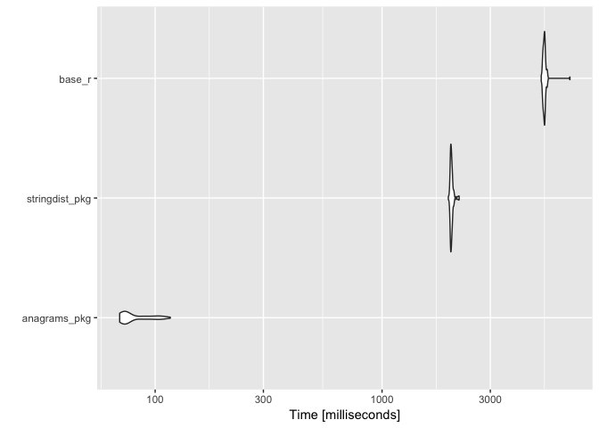

<!-- README.md is generated from README.Rmd. Please edit that file -->
anagrams
========

[](https://travis-ci.org/ChrisMuir/anagrams)

`anagrams` is a super simple R package providing a function for comparing character vectors and determining if strings are [anagrams](https://en.wikipedia.org/wiki/Anagram) of one another. The project was inspired by [this](http://www.programmingr.com/content/simple-anagram-finder-using-r/) blog post on finding anagrams in R. The package uses C++ and [Rcpp](https://CRAN.R-project.org/package=Rcpp) for speed.

If you're interested in anagrams and R, be sure to check out [Romain Francois'](https://github.com/romainfrancois) package [anagram](https://github.com/romainfrancois/anagram) (and h/t to Romain for [pointing out](https://twitter.com/romain_francois/status/972754279164514304) some bottle-necks in my cpp code).

Also, thank you to [Mark van der Loo](https://github.com/markvanderloo) for pointing out that the [stringdist](https://github.com/markvanderloo/stringdist) package can be used to concisely determine same-length anagrams (and it's faster than the base R function I defined below!) I included the `stringdist` solution in the benchmarks below.

Installation
------------

Install from github with:

``` r
# install.packages("devtools")
devtools::install_github("ChrisMuir/anagrams")
```

Example Usage
-------------

The exported function `is_anagram` takes as input a string and a character vector, and looks for anagrams of the string in the character vector.

``` r
library(anagrams)

# Test for anagrams that are the same length as the input string.
is_anagram("stac", c("cats are great", "tacs", "frogs", "cats", "ts"))
#> [1] FALSE  TRUE FALSE  TRUE FALSE

# Use arg "value" to return the values that are anagrams.
is_anagram("stac", c("cats are great", "tacs", "frogs", "cats", "ts"), value = TRUE)
#> [1] "tacs" "cats"

# Set arg "any_len" to TRUE to test for anagrams that are any length (either same length or sub-string).
is_anagram("stac", c("cats are great", "tacs", "frogs", "cats", "ts"), any_len = TRUE)
#> [1]  TRUE  TRUE FALSE  TRUE FALSE

# Use arg "ignore_spaces" to make anagram searching insensitive to spaces.
is_anagram("s t a c", c("cats are great", "t acs", "frogs", "ca   ts", "ts"), ignore_spaces = TRUE)
#> [1] FALSE  TRUE FALSE  TRUE FALSE

# Use arg "ignore_case" to make anagram searching insensitive to lower/upper case.
is_anagram("STAc", c("catS are great", "tacs", "frogs", "CaTS", "ts"), ignore_case = TRUE)
#> [1] FALSE  TRUE FALSE  TRUE FALSE
```

Benchmarks
----------

Let's create a simple, base R version of `is_anagram` that searches for same-length anagrams, and compare speeds.

``` r
r_is_anagram <- function(string, terms) {
  out <- rep(FALSE, length(terms))
  terms_to_insp <- which(nchar(terms) == nchar(string))
  if (length(terms_to_insp) == 0) {
    return(out)
  }
  
  string_spl <- unlist(strsplit(string, "", fixed = TRUE), FALSE, FALSE)
  str_counts <- vapply(string_spl, function(x) sum(string_spl == x), integer(1))
  terms_spl <- strsplit(terms, "", fixed = TRUE)
  
  out[terms_to_insp] <- vapply(terms_spl[terms_to_insp], function(x) {
    anagram <- TRUE
    for (char in string_spl) {
      if (str_counts[char] != sum(x == char)) {
        anagram <- FALSE
        break
      }
    }
    anagram
  }, logical(1), USE.NAMES = FALSE)
  
  out
}

# Test to make sure its output is identical to that of pkg function is_anagram.
identical(
  r_is_anagram("stac", c("cats are great", "tacs", "frogs", "cats", "ts")), 
  is_anagram("stac", c("cats are great", "tacs", "frogs", "cats", "ts"))
)
#> [1] TRUE
```

And for completeness, here is a similar function that uses `stringdist::stringdist()` to find same-length anagrams.

``` r
library(stringdist)

sd_is_anagram <- function(string, terms) {
  out <- rep(FALSE, length(terms))
  terms_to_insp <- which(nchar(terms) == nchar(string))
  if (length(terms_to_insp) == 0) {
    return(out)
  }
  
  out[terms_to_insp] <- stringdist(string, terms[terms_to_insp], method="qgram", q=1) == 0
  
  out
}

# Test to make sure its output is identical to that of pkg function is_anagram.
identical(
  sd_is_anagram("stac", c("cats are great", "tacs", "frogs", "cats", "ts")), 
  is_anagram("stac", c("cats are great", "tacs", "frogs", "cats", "ts"))
)
#> [1] TRUE
```

Now we'll compare speeds.

``` r
library(microbenchmark)
library(stringi)


# Test in which each element is shorter than the input string.

test_vect <- stringi::stri_rand_strings(100000, 3)
microbenchmark(
  anagrams_pkg = is_anagram("cats", test_vect), 
  stringdist_pkg = sd_is_anagram("cats", test_vect), 
  base_r = r_is_anagram("cats", test_vect)
) -> mb

print(mb)
#> Unit: milliseconds
#>            expr       min        lq      mean    median        uq      max neval
#>    anagrams_pkg  2.881423  3.525425  4.021074  3.844908  4.266404 11.03156   100
#>  stringdist_pkg 15.315525 15.921312 17.256385 16.312648 17.405777 31.04395   100
#>          base_r 15.051156 16.082214 17.266148 16.510351 17.604196 26.37956   100

autoplot.microbenchmark(mb)
```



``` r


# Test in which each element is the same length as the input string.

test_vect <- stringi::stri_rand_strings(100000, 4)
microbenchmark(
  anagrams_pkg = is_anagram("cats", test_vect), 
  stringdist_pkg = sd_is_anagram("cats", test_vect), 
  base_r = r_is_anagram("cats", test_vect)
) -> mb

print(mb)
#> Unit: milliseconds
#>            expr        min         lq       mean    median         uq        max neval
#>    anagrams_pkg   3.930946   4.418756   6.403174   5.33026   8.961391   9.459983   100
#>  stringdist_pkg  30.798884  32.814780  41.363030  41.46304  51.061384  60.805754   100
#>          base_r 230.129447 249.446249 290.188437 274.38873 325.527552 401.477623   100

autoplot.microbenchmark(mb)
```


``` r


# Test in which each element is an anagram of the input string.

test_vect <- rep("tacs", 100000)
microbenchmark(
  anagrams_pkg = is_anagram("cats", test_vect), 
  stringdist_pkg = sd_is_anagram("cats", test_vect), 
  base_r = r_is_anagram("cats", test_vect)
) -> mb

print(mb)
#> Unit: milliseconds
#>            expr        min         lq       mean     median        uq       max neval
#>    anagrams_pkg   6.032617   6.174131   8.672862   6.460368  12.79368  13.60459   100
#>  stringdist_pkg  20.167271  21.144735  28.287279  23.469102  36.77468  41.28809   100
#>          base_r 516.538887 542.028019 590.663058 604.686332 623.25734 700.31462   100

autoplot.microbenchmark(mb)
```


``` r


# Test in which each element is a string with length between two and six chars.

test_vect <- stringi::stri_rand_strings(100000, 2:6)
microbenchmark(
  anagrams_pkg = is_anagram("cats", test_vect), 
  stringdist_pkg = sd_is_anagram("cats", test_vect), 
  base_r = r_is_anagram("cats", test_vect)
) -> mb

print(mb)
#> Unit: milliseconds
#>            expr       min        lq       mean     median         uq        max neval
#>    anagrams_pkg  2.944681  3.766089   5.270952   5.613658   6.524147   7.198479   100
#>  stringdist_pkg 19.105867 23.138215  30.249420  31.577503  37.347316  39.049870   100
#>          base_r 73.373744 93.263171 119.200591 119.970260 140.210453 208.282373   100

autoplot.microbenchmark(mb)
```


``` r


# Test in which each element is a long string (nchar == 1000).

test_str <- stringi::stri_rand_strings(1, 1000)
test_vect <- stringi::stri_rand_strings(100000, 1000)
microbenchmark(
  anagrams_pkg = is_anagram(test_str, test_vect), 
  stringdist_pkg = sd_is_anagram(test_str, test_vect), 
  base_r = r_is_anagram(test_str, test_vect)
) -> mb

print(mb)
#> Unit: milliseconds
#>            expr        min         lq       mean     median         uq       max neval
#>    anagrams_pkg   69.79089   72.50462   82.09632   74.92934   89.44213  116.6318   100
#>  stringdist_pkg 1959.91668 2004.75443 2025.03711 2018.05366 2036.10158 2187.0023   100
#>          base_r 5030.08627 5139.72163 5205.26548 5191.46462 5225.21471 6732.3260   100

autoplot.microbenchmark(mb)
```


